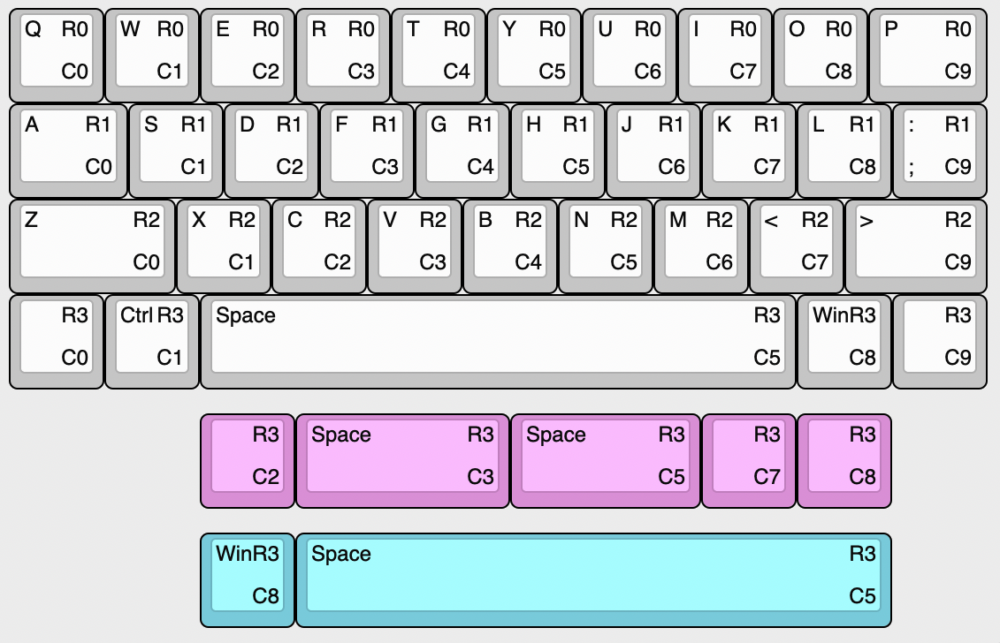

# qaz_inspired

My take on a qaz inspired boards. Mostly the difference is integrated mcu.

## qaz_m **untested**

- integrated mcu
- shifted bottom row

## qazv4n_m **untested**

- integrated mcu
- hotswap
- shifted bottom row
- removable gamer row
