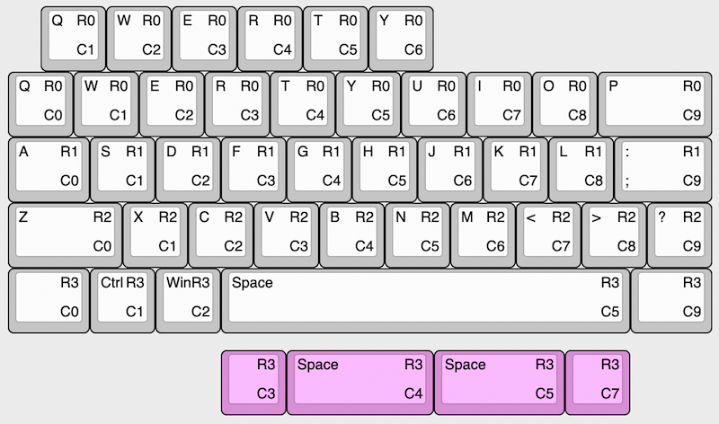

# qaziv4n

My take on an integrated mcu hot-swap [qaz](https://www.cbkbd.com/product/qaz-keyboard-kit) with a [van](https://trashman.wiki/en/keyboards/v4n4g0n) backspace and gamer row.

The plate file can be found in the [docs](./docs) folder.

